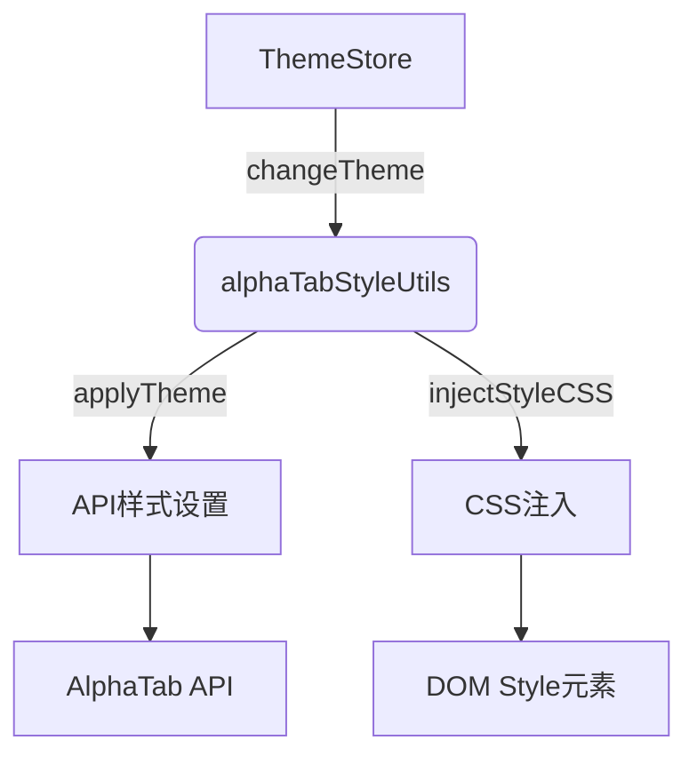

# 样式管理方案分析

## 1. 全局样式管理
- **基础样式**：`style.css`
  - 重置默认样式
  - 设置全局盒模型
- **滚动条样式**：`scrollbar.css`
  - 统一WebKit和Firefox滚动条样式
  - 支持暗色主题

## 2. 组件样式隔离
- **Vue scoped样式**：
  - 示例：DarkTheme.vue中的`<style scoped>`
  - 自动添加data-v属性实现隔离
- **CSS Modules**：未使用

## 3. 主题切换机制

- **主题类型**：default/dark/ocean/vibrant
- **实现方式**：
  - Pinia store管理当前主题
  - alphaTabStyleUtils处理具体切换逻辑
  - 支持API设置和CSS注入两种方式

## 4. 动态样式控制
- **alphaTabStyleUtils**功能：
  - 颜色验证和创建
  - 主题应用和重置
  - 样式注入和移除
- **动态控制点**：
  - 通过API实时修改AlphaTab样式
  - 动态注入/移除CSS样式表

## 5. 主题配置文件
- **位置**：`src/config/themes/`
- **格式**：导出的CSS字符串常量
- **示例**：DarkDefault.ts中的详细样式覆盖

## 6. 改进建议
1. 增加主题切换动画
2. 统一颜色管理到单独配置文件
3. 考虑使用CSS变量增强主题灵活性