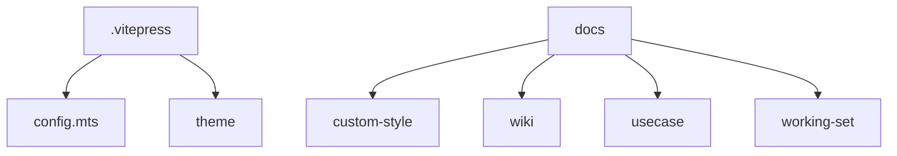

# AlphaTab Vue项目文档与部署方案

`roo code` + `deepseek-v3-0324`

`Orchestrator` 模式

```markdown
我想为 @/docs 这个文档文件夹生成一个vitepress网站用来展示开发过程中的文档，通过github action部署。请注意这个项目下已经有了一个vue3+vite网站，如何通过github actions和GitHub pages部署这个网站和文档网站？
```

第一次提示词之后已经可以打开预览网页了

```bash
npm run docs:dev

Port 5173 is in use, trying another one...
# 这是因为alphatab网站运行在  http://localhost:5173/ 上
  vitepress v1.6.3

  ➜  Local:   http://localhost:5174/docs/
```

```markdown
非常好，现在在 @/docs 文件夹下需要完善以下内容：

1.首页配置导航 index.md
2.根据目前的内容生成侧边栏导航，写入 @/docs/.vitepress/config.mts 
包括@/docs/custom-style  @/docs/issue 等文件夹下面，可以使用命令行工具或者其他方式获取markdown文件名称

采取二级目录
例如：
custom-style
- color-scheme
- darkmode-prompt
issue
- imcomplete-apply.md
```

这个其实已经是一个简单版的让 roo code 自动生成侧边栏导航的任务，可以简化为：

```markdown
根据 @/docs 文件夹下的文件目录，补充 @/docs/.vitepress/config.mts 的目录导航侧边栏
```

## 1. 文档结构设计



## 2. VitePress配置

```javascript
// docs/.vitepress/config.mts
import { defineConfig } from 'vitepress'

export default defineConfig({
  title: 'AlphaTab Vue 文档',
  description: 'AlphaTab Vue组件库文档',
  base: '/docs/',
  themeConfig: {
    nav: [
      { text: '指南', link: '/custom-style/first-step' },
      { text: 'API', link: '/wiki/API' },
      { text: '开发', link: '/wiki/DEVELOPMENT' }
    ],
    sidebar: {
      '/custom-style/': autoSidebarConfig,
      '/wiki/': autoSidebarConfig
    }
  }
})
```

## 3. GitHub Actions工作流

```yaml
name: Deploy to GitHub Pages

on:
  push:
    branches: [main]

jobs:
  deploy:
    runs-on: ubuntu-latest
    steps:
      - uses: actions/checkout@v4
      - name: Install dependencies
        run: npm install
      - name: Build main app
        run: npm run build
      - name: Build docs
        run: |
          cd docs
          npm install
          npm run docs:build
          mv .vitepress/dist ../../dist/docs
      - name: Deploy
        uses: peaceiris/actions-gh-pages@v3
        with:
          github_token: ${{ secrets.GITHUB_TOKEN }}
          publish_dir: ./dist
          keep_files: true
```

## 4. 项目结构调整

1. 新增目录结构：

```
   docs/
   ├── .vitepress/
   │   ├── config.mts
   │   └── theme/
   ├── public/
   └── (现有文档目录)
```

2. 主应用vite配置调整：

```typescript
   // vite.config.ts
   base: process.env.NODE_ENV === 'production' ? '/' : '/'
```

3. package.json新增脚本：

```json
   {
     "scripts": {
       "docs:dev": "vitepress dev docs",
       "docs:build": "vitepress build docs"
     }
   }
```
