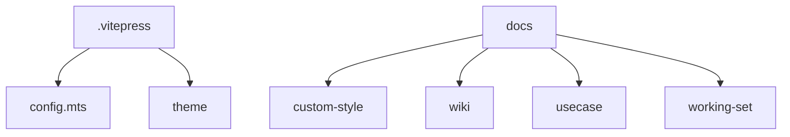

# VitePress文档部署方案

## 1. 文档结构设计



## 2. VitePress配置

```javascript
// docs/.vitepress/config.mts
import { defineConfig } from 'vitepress'

export default defineConfig({
  title: 'AlphaTab Vue 文档',
  description: 'AlphaTab Vue组件库文档',
  base: '/docs/',
  themeConfig: {
    nav: [
      { text: '指南', link: '/custom-style/first-step' },
      { text: 'API', link: '/wiki/API' },
      { text: '开发', link: '/wiki/DEVELOPMENT' }
    ],
    sidebar: {
      '/custom-style/': autoSidebarConfig,
      '/wiki/': autoSidebarConfig
    }
  }
})
```

## 3. GitHub Actions工作流

```yaml
name: Deploy to GitHub Pages

on:
  push:
    branches: [main]

jobs:
  deploy:
    runs-on: ubuntu-latest
    steps:
      - uses: actions/checkout@v4
      - name: Install dependencies
        run: npm install
      - name: Build main app
        run: npm run build
      - name: Build docs
        run: |
          cd docs
          npm install
          npm run docs:build
          mv .vitepress/dist ../../dist/docs
      - name: Deploy
        uses: peaceiris/actions-gh-pages@v3
        with:
          github_token: ${{ secrets.GITHUB_TOKEN }}
          publish_dir: ./dist
          keep_files: true
```

## 4. 项目结构调整

1. 新增目录结构：
   ```
   docs/
   ├── .vitepress/
   │   ├── config.mts
   │   └── theme/
   ├── public/
   └── (现有文档目录)
   ```

2. 主应用vite配置调整：
   ```typescript
   // vite.config.ts
   base: process.env.NODE_ENV === 'production' ? '/' : '/'
   ```

3. package.json新增脚本：
   ```json
   {
     "scripts": {
       "docs:dev": "vitepress dev docs",
       "docs:build": "vitepress build docs"
     }
   }