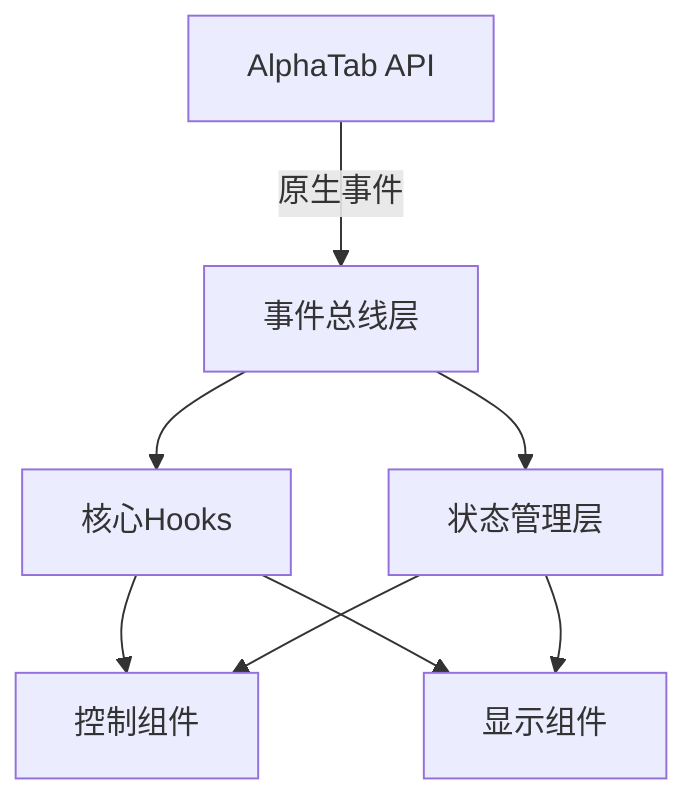

# AlphaTab-Vue 事件架构重构方案

## 1. 当前架构问题分析
- **事件监听分散**：AlphaTab原生事件、Vue组件事件、全局事件混合使用
- **状态管理不一致**：provide/inject、组件内部状态、全局事件混合管理
- **重复逻辑**：各控制组件重复监听相同事件(如scoreLoaded)
- **缺乏统一错误处理**

## 2. 新架构设计



## 3. 核心模块实现

### 3.1 事件总线层 (`useAlphaTabEventBus`)
```typescript
// 完整类型定义
type AlphaTabEventMap = {
  playerStateChanged: {state: number}
  scoreLoaded: Score | null
  playerPositionChanged: {currentTime: number}
  // 其他事件...
}

export function useAlphaTabEventBus() {
  const api = inject<Ref<AlphaTabApi>>('alphaTabApi')
  
  if (!api?.value) {
    throw new Error('AlphaTab API not provided')
  }

  const registerEvent = <K extends keyof AlphaTabEventMap>(
    eventName: K,
    handler: (payload: AlphaTabEventMap[K]) => void
  ) => {
    api.value[eventName].on(handler)
    onUnmounted(() => api.value[eventName].off(handler))
  }

  return {
    onPlayerStateChanged: (handler: (state: AlphaTabEventMap['playerStateChanged']) => 
      registerEvent('playerStateChanged', handler),
    onScoreLoaded: (handler: (score: AlphaTabEventMap['scoreLoaded']) => 
      registerEvent('scoreLoaded', handler),
    // 其他事件...
  }
}
```

### 3.2 核心Hooks

#### `usePlayerControl` (完整实现)
```typescript
type PlayerState = 0 | 1 | 2 // 0=stopped, 1=playing, 2=paused

export function usePlayerControl() {
  const api = inject<Ref<AlphaTabApi>>('alphaTabApi')
  const { onPlayerStateChanged } = useAlphaTabEventBus()
  const playerState = ref<PlayerState>(0)
  
  onPlayerStateChanged(({state}) => {
    playerState.value = state as PlayerState
  })

  const playPause = () => {
    try {
      api.value?.playPause()
    } catch (error) {
      console.error('Play/Pause failed:', error)
    }
  }

  const stop = () => {
    try {
      api.value?.stop()
    } catch (error) {
      console.error('Stop failed:', error)
    }
  }

  return { playerState, playPause, stop }
}
```

## 4. 实施细节补充

### 4.1 组件重构步骤
1. **播放控制组件**:
   - 替换原有事件监听为usePlayerControl
   - 统一错误处理逻辑
   - 更新模板绑定

2. **时间显示组件**:
   - 创建useTimePosition hook
   - 处理时间格式化逻辑
   - 集成到事件总线

3. **样式控制组件**:
   - 创建useStyleManager hook
   - 统一样式切换逻辑
   - 持久化用户偏好

### 4.2 测试方案
1. 单元测试:
   - 每个hook的独立测试
   - 事件总线功能验证

2. 集成测试:
   - 组件与hook的交互
   - 跨组件状态同步

3. E2E测试:
   - 完整播放流程
   - 异常场景处理

### 4.3 回滚计划
1. 创建feature分支进行重构
2. 分阶段提交代码
3. 准备紧急回滚commit
4. 保留旧组件作为备份
