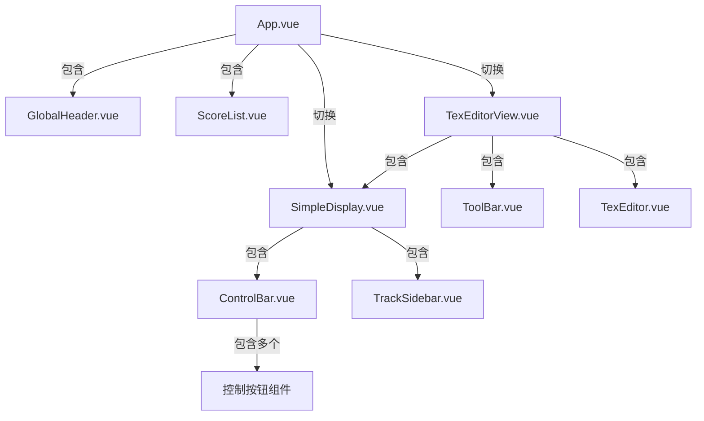
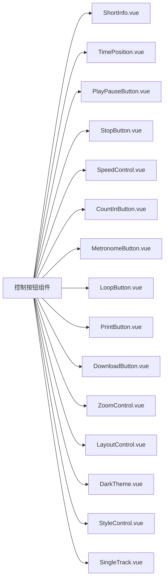

# 组件架构文档

## 整体组件结构





## 主要组件说明

### App.vue (根组件)
- 功能: 管理全局状态和视图切换
- 包含:
  - GlobalHeader: 顶部导航栏
  - ScoreList: 乐谱选择模态框
- 视图切换:
  - SimpleDisplay: 乐谱播放视图
  - TexEditorView: 乐谱编辑视图

### SimpleDisplay.vue (乐谱显示组件)
- 功能: 核心乐谱显示和播放组件
- 包含:
  - ControlBar: 底部控制栏
  - TrackSidebar: 音轨控制侧边栏
- 通过alphaTabApi与AlphaTab库交互

### TexEditorView.vue (乐谱编辑器)
- 功能: AlphaTex乐谱编辑和预览
- 包含:
  - ToolBar: 编辑器工具栏
  - TexEditor: 文本编辑器
  - SimpleDisplay: 复用作为预览面板

### ControlBar.vue (控制栏容器)
- 功能: 动态加载控制按钮组件
- 特性:
  - 通过features prop控制显示哪些按钮
  - 包含多个独立功能按钮组件

### TrackSidebar.vue (音轨侧边栏)
- 功能: 音轨控制管理
- 特性:
  - 显示/隐藏音轨
  - 静音/取消静音
  - 独奏模式
  - 音量控制

## 控制组件文档

### MetronomeButton
节拍器开关按钮

#### Props
无

#### Events
- click: 切换节拍器状态

#### 使用示例
```vue
<MetronomeButton />
```

### CountInButton
倒计时按钮

#### Props
无

#### Events
- click: 切换倒计时状态

### LayoutControl
布局控制组件

#### Props
- value: 当前布局模式
- options: 可选布局模式数组

#### Events
- input: 布局模式变更事件

### ZoomControl
缩放控制组件

#### Props
- value: 当前缩放比例
- min: 最小缩放比例
- max: 最大缩放比例
- step: 缩放步长

#### Events
- input: 缩放比例变更事件

### PrintButton
打印按钮

#### Props
无

#### Events
- click: 触发打印操作

### LoopButton
循环播放按钮

#### Props
- active: 是否激活循环

#### Events
- click: 切换循环状态

### PlayPauseButton
播放/暂停切换按钮

#### 状态
- playerState: 
  - 0: 停止状态
  - 1: 播放中
  - 2: 暂停中

#### 功能
- 点击切换播放/暂停状态
- 自动根据播放器状态更新图标
- 乐谱未加载时自动禁用

#### 使用示例
```vue
<PlayPauseButton />
```

### StopButton
停止播放按钮

#### 功能
- 点击停止当前播放
- 乐谱未加载时自动禁用

#### 使用示例
```vue
<StopButton />
