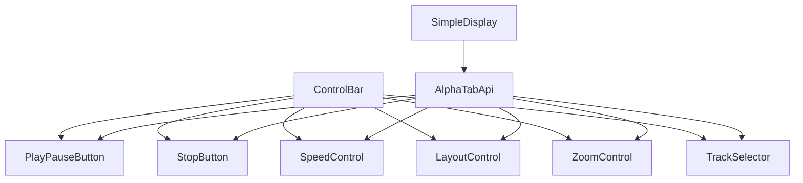

# alphaTab Vue 项目

基于AlphaTab的Vue 3音乐乐谱编辑器
## 架构图

```mermaid
graph TD
    A[ControlBar] --> B[PlayPauseButton]
    A --> C[StopButton] 
    A --> D[SpeedControl]
    A --> E[LayoutControl]
    A --> F[ZoomControl]
    A --> G[TrackSelector]
    
    H[AlphaTabApi] --> B
    H --> C
    H --> D
    H --> E
    H --> F
    H --> G
    
    I[SimpleDisplay] --> H
```

## 核心功能

## 功能描述
- 乐谱显示与渲染
- 播放控制（播放/暂停/停止）
- 节拍器功能
- 循环播放
- 打印乐谱
- 缩放控制

## 技术栈
- Vue 3 + TypeScript
- Vite构建工具
- AlphaTab乐谱渲染引擎
- Lucide图标库