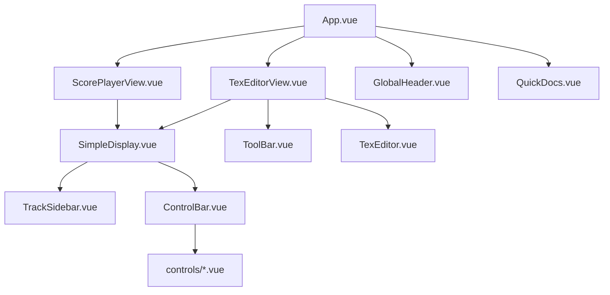

# 组件层级分析

## 组件层级图

## 主要组件关系

1. **全局组件**:
   - GlobalHeader: 应用顶部导航栏，通过Pinia与各视图通信
   - QuickDocs: 文档快速查看面板，通过事件总线与父组件通信

2. **核心视图组件**:
   - ScorePlayerView: 乐谱播放视图，包含SimpleDisplay
   - TexEditorView: AlphaTex编辑器视图，包含ToolBar/TexEditor/SimpleDisplay

3. **功能组件**:
   - SimpleDisplay: 乐谱显示核心组件，包含TrackSidebar和ControlBar
   - ControlBar: 播放控制栏，动态渲染controls子组件
   - TexEditor: AlphaTex编辑器，通过v-model与父组件双向绑定

## 组件通信方式

1. **Props/Events**:
   - 父传子: 如controlBarFeatures、scoreData等props
   - 子传父: 如@update-font-size、@save-tex等自定义事件

2. **Provide/Inject**:
   - alphaTabApi: 在SimpleDisplay中provide，在ControlBar及子组件中inject
   - editorInstance: TexEditor提供的编辑器实例

3. **Store(Pinia)**:
   - uiStore: 管理UI状态(侧边栏、主题等)
   - texFilesStore: 管理Tex文件状态
   - themeStore: 管理主题配置

4. **LocalStorage**:
   - 编辑器配置(字体大小、滚动行为等)
   - 用户保存的Tex文件内容

## 关键组件详细分析

### SimpleDisplay.vue
- 核心功能: 渲染乐谱并提供交互
- 子组件:
  - TrackSidebar: 音轨选择侧边栏，通过store通信
  - ControlBar: 播放控制栏，通过provide/inject共享api
- 通信方式:
  - 接收score/tex内容作为props
  - 通过provide共享alphaTabApi
  - 通过事件通知父组件播放状态变化

### ControlBar.vue
- 动态渲染controls子组件
- 功能:
  - 通过features prop控制显示哪些控件
  - 使用provide/inject共享alphaTabApi
  - 通过store管理播放状态
- 子组件示例:
  - PlayPauseButton: 播放/暂停控制
  - SpeedControl: 播放速度控制
  - DarkTheme: 主题切换控制

### TexEditorView.vue
- 编辑器核心视图
- 组件结构:
  - ToolBar: 提供文件操作功能(新建/保存/加载)
  - TexEditor: 代码编辑器核心
  - SimpleDisplay: 实时预览面板
- 通信方式:
  - 与TexEditor通过v-model双向绑定
  - 与ToolBar通过自定义事件交互
  - 通过LocalStorage持久化编辑器状态