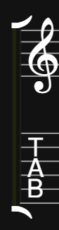
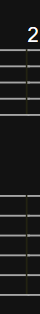
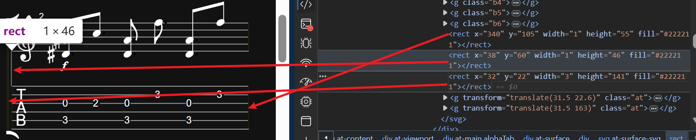
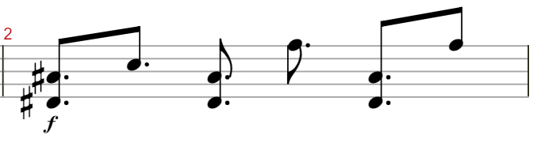
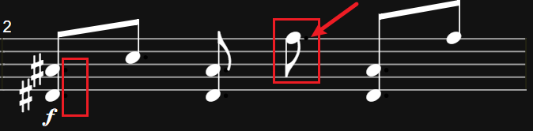
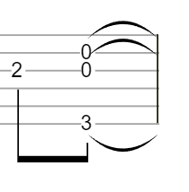

- [符干 (Stems)、符尾 (Flags) 和符杠 (Beams)在最初的着色方案中没有被覆盖](../issue/imcomplete-apply.md)

目前查看下来需要优化的部分

## 工作集

`\src\utils\alphaTabStyleUtils.ts`
`\src\components\SimpleDisplay.vue`

第一步保证所有元素都被新的样式覆盖
只使用简单的暗色主题


第二步，优化暗色主题，使其更加现代化
在原有css结构下只需要微调颜色即可，保持一致性。

## 未覆盖样式元素

### 大谱表连接号



最左侧这个符号是大谱表连接号，也叫做大括号或联合谱号（Grand Staff Brace）。

它用来连接高音谱号（G clef）和吉他六线谱（TAB谱）这两行谱表，表示它们是同一乐器或同一声部演奏的。在传统的钢琴谱中，它常用来连接高音谱表和低音谱表。而在这里，它将高音谱表和吉他六线谱连接起来，这在吉他记谱中很常见，可以同时显示音高信息和指法信息。

```html
<rect x="32" y="22" width="3" height="141" fill="#222211"></rect>
```

### 小节线



```html
<rect x="340" y="105" width="1" height="55" fill="#222211"></rect>
```

对应关系如图：



### 附点





### 延音线

